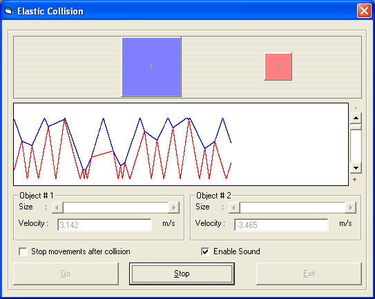



## Elastic Collision

### Description

Do you like math and physics? If "Yes", then here is the program that you're looking for, but if "No", then you still have a chance to like this program if you like graphics or games programming.

This program is an application for the elastic collision between two objects. In elastic collision, the total momentum is always conserved, and after collision, the final velocities get distributed based on the masses and initial velocities of the two objects.

This program is a good example of how to use math to move objects, detect collisions, draw graphs, and change objects sizes and positions.

In this program, I made sure that all buttons get disabled during the movement except the Stop button, and I used the idea of global variables to exit the loop of action.

One last thing, I think this program is kind of fun, especailly if you try different masses with different initial velocities. The graph also shows some intersting patterns of movements.

I hope you'll learn something out of it... Good luck ...
 
### More Info
 

             |
---                |---
**Submitted On**   |2003-08-10 20:19:20
**By**             |[Yehia Muhsen](https://github.com/Planet-Source-Code/PSCIndex/blob/master/ByAuthor/yehia-muhsen.md)
**Level**          |Intermediate
**User Rating**    |4.7 (47 globes from 10 users)
**Compatibility**  |VB 6\.0
**Category**       |[Miscellaneous](https://github.com/Planet-Source-Code/PSCIndex/blob/master/ByCategory/miscellaneous__1-1.md)
**World**          |[Visual Basic](https://github.com/Planet-Source-Code/PSCIndex/blob/master/ByWorld/visual-basic.md)
**Archive File**   |[Elastic\_Co1627508102003\.zip](https://github.com/Planet-Source-Code/yehia-muhsen-elastic-collision__1-47542/archive/master.zip)

